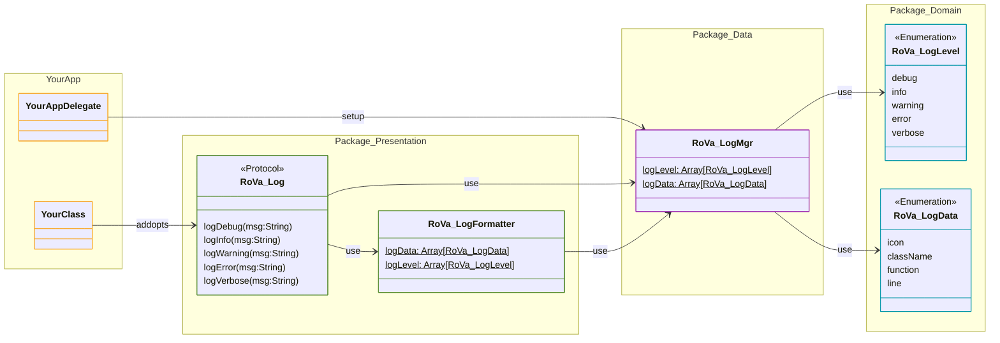

# RoVa_Log (1.1.0)

Private Swift Package for estandar terminal debug log

## Setup (Optional)

```swift
import RoVa_Log

@UIApplicationMain
class AppDelegate: UIResponder, UIApplicationDelegate {
    func application(_ application: UIApplication, didFinishLaunchingWithOptions launchOptions: [UIApplication.LaunchOptionsKey : Any]? = nil) -> Bool {
        
        // 1) Setup log type enabled, all levels are enabled by default
        RoVa_LogMgr.logLevel = [.error]
        
        // 2) Setup log data that will be showed
        RoVa_LogMgr.logData = [.icon,.className,.function]

        return true
    }
}
```

## Protocol 

implements RoVaLog protocl in any class, struct or enum when you need terminal debug

Swift file:

```swift
import RoVa_Log

class YourClass: RoVa_Log {
    func anyFunction() {
        logDebug() // no argument required
        logError(msg: "any text")        
    }
}
```
Terminal output:
```terminal
• 🔎 YourClass.anyFunction [0017]
• ❌ YourClass.anyFunction [0018]: any text
```

## UML




## Documentation

- [Workflows](./doc/workflows.md)
